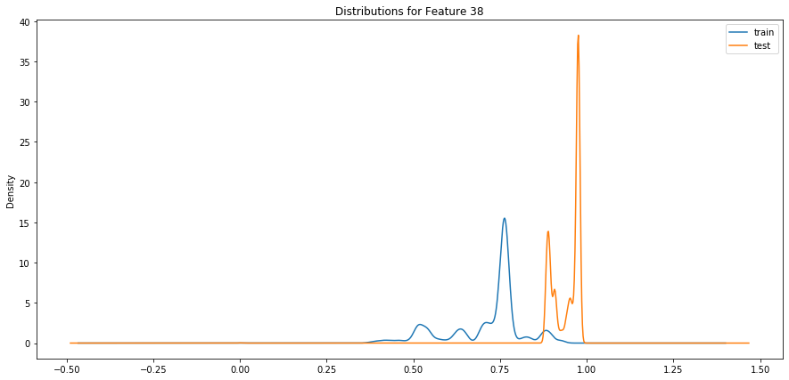

# Appendix I: Investigation of Training / Test Data Sets Mismatch

## Introduction

It was suspicious that models with a high accuracy (over 98%) when run with cross validation on the training set should score
barely better than chance (52-54%) on the test set. Prediction is only possible if both the training set and test set 
are drawn from the same underlying population and have features that have been identically preprocessed so it was 
hypothesised that there were some difference between the training data and test data that was causing this.

A comparison of the provided training set and test set was done and it appears that for some features the 
values in the tests set are considerably different from the values in the training set.    The data sets 
provided had already been scaled so that all values lay in the interval 0 to 1 so a possible cause of 
the discrepancies was from errors introduced by this pre-processing.

## Initial investigation - Kolmogorov-Smirnov test

To get an overview of the problem the Kolmogorv-Smirnov test[1] was used to compare each column in the training data with
the same column in the test data.  The k-s statistic tests the null hypothesis that two sample sets come from the same 
underlying distribution.  First all columns with zero variance in either the test set or training set were removed, 
leaving 69 columns.  The ks_2samp function from the scipy package[2] was used to compare the training data and test data
for each of the remaining features.  Of the 69 features 40 had a p-value at or close to zero (rejecting the null 
hypothesis) and 18 had a p-value at or close to 1.  The remaining 11 features were somewhere in between.  This gives
an indication that there may be a problem but is not conclusive, particularly since the k-s test assumes that the
underlying distribution is continuous.  
 
## Direct Comparison of Single Features
To investigate further individual features were selected so that they could be compared directly.  

### Feature 38
First to be compared was feature "38" (where "38" is the column header in the original CSV file).
The distributions were compared by a kde plot for both the training and test data for the feature.

__Figure I.1__

From this plot it appears that the overall shapes are similar but shifted up on the test set. One 
possible reason for this could be that the data sets were wrongly scaled. You could get this 
effect if it the training set and test set had been scaled independently instead of the scaler 
being fit to the training data and applied to the test data - an outlier in the training set 
could push all the other values down after scaling. Unfortunately we do not have access to 
the original data to test this hypothesis. 
 
### Categorical Features
Several features were found that appeared to be categorical (they only took 2 or 3 values in both data
sets) but the values for the categories were completely different.  For example feature "129" has this
distribution in the test set: 

+-------+-------+
| value | count |
+=======+=======+
|  0.0  | 38897 |
+-------+-------+
|  1.0  |  1261 |
+-------+-------+

Which seems reasonable for a 2-value categorical feature.  However the training data has

+-----------+-------+
| value     | count |
+===========+=======+
| 0.0       | 94954 |
+-----------+-------+
| 0.0000158 |  2090 |
+-----------+-------+

The count ratios are similar, but the values are different by four orders magnitude.

Similar results have been found for other categorical features.  For example feature "128" appears to
have three categories and the training set is similarly mis-scaled:

+-----------------+-----------------+---------------------+---------------------+
| test set values | test set counts | training set values | training set counts |
+=================+=================+=====================+=====================+
|  0.0            | 38897           | 0.0                 | 94954               |
+-----------------+-----------------+---------------------+---------------------+
|  0.5            |   141           | 0.0000155           |   147               |
+-----------------+-----------------+---------------------+---------------------+
|  1.0            |  1120           | 0.0000309           |  1943               |
+-----------------+-----------------+---------------------+---------------------+

Several other features were found to have similar problems, mostly in the range "108"-"129".

# Conclusion
It is seems from the above that some of the features have been corrupted by the scaling process.  
For this reason the data sets should be considered unfit for purpose and regenerated from the original 
raw data if available.

[1] J.L. Hodges Jr., “The Significance Probability of the Smirnov Two-Sample Test,”
 Arkiv fiur Matematik, 3, No. 43 (1958), 469-86.
 
[2] P.Virtanen et al (2019) "SciPy 1.0–Fundamental Algorithms for Scientific Computing in Python". 
preprint arXiv:1907.10121  https://arxiv.org/abs/1907.10121
