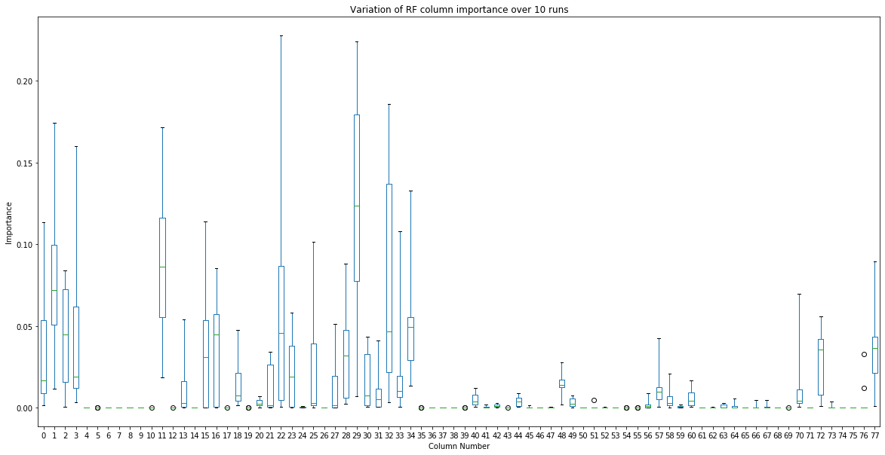

# Feature Selection

The purpose of feature selection is to reduce the dimensionality of the problem space 
by eliminating features from the model that are redundant or unnecessary for prediction. This can improve
accuracy if the eliminated features are irrelevant to the model or are strongly correlated to other features.
Feature selection can also speed up training and prediction times and make the model more interpretable.

## Embedded Feature Selection Via Tree Based Algorithms
The initial method chosen for feature selection was to use tree based supervised learning algorithms to 
identify the most relevant features. Three algorithms were selected for comparison:  Random Forest [1], XGBoost [2] and 
CatBoost [3].  As explained in the previous section columns with zero variance had been removed leaving 78 features as a
starting point for further elimination.

Each model was fit to the training data and their feature importance ratings compared to see which columns they had in common.
However it was observed that the ratings given by Random Forest were not stable - repeatedly fitting to the same
data set gave substantially different results each time.  Figure 2.1 shows a boxplot for each feature with the variation
in feature importance assigned by Random Forest over 10 runs.  Both XGBoost and CatBoost were consistent in their importance measures.
Due to this variability Random Forest was dropped as a means of selecting features.

  
__figure 2.1__

The top twenty features selected by the remaining algorithms were (going from lowest importance to highest):
```python
xgboost: [31, 25, 28, 52, 32, 49, 13, 44, 20, 56, 18, 0, 72, 2, 48, 11, 34, 57, 29, 22]
catboost: [77, 49, 31, 20, 70, 30, 1, 0, 33, 32, 72, 18, 48, 2, 3, 34, 57, 29, 22, 11]
```
N.B. These are the column indexes after the zero-variance columns have been removed.  These both accounted for over 99% of the
importance values assigned by the respective algorithms. 

The intersection of these gave a set of 14 features that both XGBoost and CatBoost considered important:
```python
XGBoost and CatBoost Intersection: {0, 32, 2, 34, 72, 11, 48, 49, 18, 20, 22, 57, 29, 31}
```

To validate the usefulness of these features 5-fold cross validation on the training set was performed with both XGBoost 
and CatBoost using the set of 14 features.  The results were promising, with accuracies upwards of 99.96% and for some
folds 100%.  The number of features was further reduced to six using the RFECV (Recursive Feature Elimination with Cross 
Validation [4]) and the CatBoost algorithm. However although this still gave a cross-validation accuracy in excess of 99.98%, 
when the model was used to predict the test data set the accuracy dropped to 53-54%, barely better than chance.   

Investigation into the cause of the poor accuracy against the test data set found that some features in the test data were 
radically different from the same features in the training data. The data had been pre-processed by a third party before 
we received it to scale all the features into the range 0 to 1.  It appears that for some columns this had been done incorrectly
so the distributions in the test data set did not match the distributions in the training data set.  Any models that depended on these 
erroneous features would behave poorly against the test data.  See appendix I for further information.

## Simple feature selection using SelectKBest, Chi-squared and ANOVA metrics

It was decided that selectively filtering out the mismatched columns between the training and test sets would be liable to 
overfitting the model to the test data, so an alternative approach was taken of using a simpler method for feature selection
and using a wider range of features.  It was found that selecting 20-40 features by doing a Chi-squared or ANOVA comparison
with the target data and selecting the K best gave good results for some algorithms.  Chi-squared was tried initially but 
does not work with the negative values created by the power transformation, so ANOVA was added as an alternative. 

The exact number of features to select and which metric to use was left as part of the model tuning stage of the process.